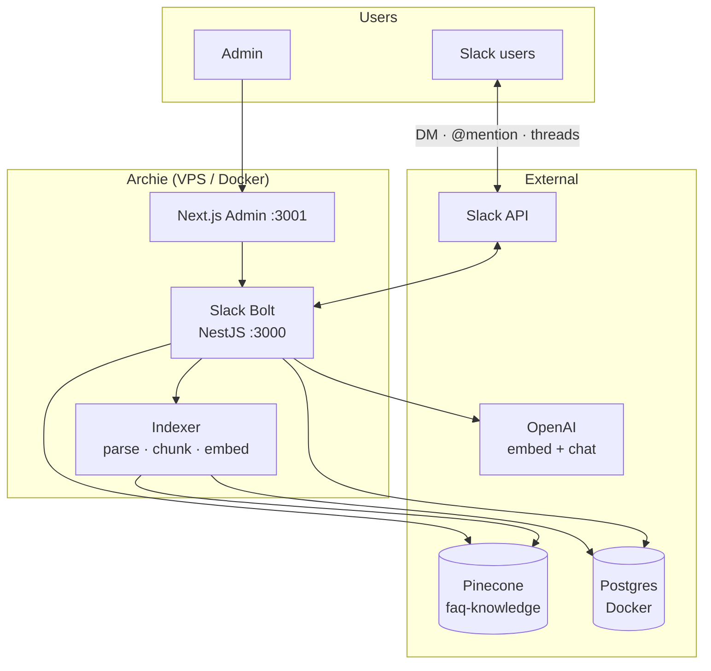
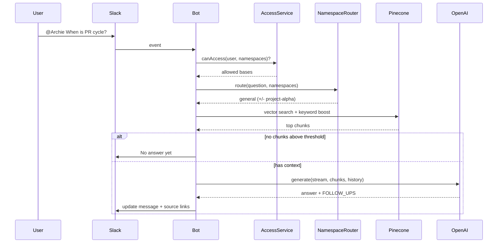

# Archie

**Slack-native RAG assistant** for company knowledge bases.

Employees ask in DM or `@mention` — Archie searches the right docs, answers in plain language, and links to Confluence / files. Admins upload content and control who sees what per namespace.

Built for **Plus8Soft hackathon**: HR, onboarding, compensation, deploy guides — one bot instead of digging through Confluence.

---

## What it does

| Problem | Archie |
|---------|--------|
| Knowledge scattered across Confluence, PDFs, wikis | Single Slack entry point |
| "Where is the leave policy?" → 20 min search | Answer + source link in ~10s |
| Project docs mixed with HR | **Namespaces** — isolated knowledge bases |
| Sensitive docs (pay, client specs) | **ACL** — email, domain, Slack group, channel |
| Generic ChatGPT hallucinates | Answers **only from retrieved chunks**; empty → `NO_DATA` |

---

## Features

### Slack bot
- **DM** — welcome screen + example questions, free-form Q&A
- **Channels** — `@Archie <question>`; empty mention → short intro
- **Threads** — follow-up without re-`@` (24h, thread owner only)
- **Streaming** — message updates while LLM generates
- **Follow-ups** — LLM suggests 2–3 related questions (from same context)
- **Feedback** — 👍 / 👎 stored for quality tracking
- **Slash commands** — `/archie`, `/faq`, `/help`
- **Intent router** — chitchat / help / RAG (no KB search on "привет")

### RAG pipeline
- **Ingest:** PDF, DOCX, Markdown, URL (Confluence, Google Docs)
- **Chunking:** LangChain markdown / recursive splitter (1k tokens, overlap)
- **Search:** Pinecone cosine + keyword boost + chunk expansion
- **Router:** picks 1–2 namespaces by profile embedding; fallback to broadcast
- **Generation:** grounded answers, source links below; `NO_DATA` when nothing relevant
- **Session memory** — last exchanges per DM / thread for follow-ups

### Admin panel
- Create **namespaces** (knowledge bases)
- Upload files or paste **URLs** → auto-index
- **Access mode:** public / restricted + rules
- Document status: pending → indexing → indexed / error

### Access control (ACL)
- Rule types: `email`, `email_domain`, `slack_group`, `slack_channel`
- Checked on every Slack request before search
- Channel-bound namespaces when bot is used in a pinned channel

### Ops
- Docker Compose + Caddy (HTTPS, one domain)
- Postgres in Docker · TypeORM migrations on startup
- Admin API rate limit · login brute-force protection · URL indexing allowlist (SSRF)
- `pnpm run rag:eval` — 26 retrieval test cases (easy → adversarial)

---

## Architecture



### Request path (one question)



### Data model (Postgres)

```
namespaces          access_rules
├── slug            ├── type (email / domain / group / channel)
├── accessMode      └── value
└── documents
    ├── filename / storagePath
    ├── status (indexed | error)
    └── chunkCount → Pinecone vectors (docId-chunk-N)
```

---

## Stack

| Layer | Tech |
|-------|------|
| Bot API | NestJS · Slack Bolt |
| Admin | Next.js · Tailwind |
| Vectors | Pinecone · `text-embedding-3-small` (1536d) |
| LLM | OpenAI · `gpt-5.4-mini` (+ nano for routing) |
| Metadata | Postgres (Docker) · TypeORM migrations |
| Deploy | Docker Compose · Caddy · Let's Encrypt · Node 22 · pnpm |

---

## Demo script (3 min)

### 1 · DM — welcome & cited answer (~60s)

DM **@Archie** → `привет` → welcome + 3 buttons (PR, onboarding, compensation).

Tap a button → loading → answer + **📎 Confluence link**.

Thread: *"what else about criteria?"* — no `@` needed.

### 2 · Channel + routing (~60s)

`@Archie how to deploy project alpha?` in channel → router picks **project-alpha** namespace, cites deploy guide.

Empty `@Archie` → intro only.

### 3 · Admin + ACL (~60s)

Admin → upload / Confluence URL → **Indexed**.

Namespace **Restricted** → rule by domain or Slack group. Wrong user → *No access*; right user → same question works.

**Finisher:** question not in KB → *No answer yet* (no hallucination, no fake suggestions).

---

## Quick start

**Production (VPS):**

```bash
cp .env.example .env   # Slack, OpenAI, Pinecone, DB_PASSWORD, DOMAIN
./deploy.sh            # bot :3000 · admin :3001 · Caddy :443
```

**Slack app:** Event URL `https://<DOMAIN>/slack/events`  
**Scopes:** `app_mentions:read`, `chat:write`, `channels:history`, `groups:history`, `im:history`, `im:write`, `commands`

**Local dev:**

```bash
pnpm install           # in bot/ and admin-panel/
cd bot && pnpm run start:dev
cd admin-panel && pnpm run dev
# ngrok http 3000 → Slack Event URL
```

**Quality check:** `cd bot && pnpm run rag:eval`

**URLs after deploy:**
- Admin panel — `https://<DOMAIN>/`
- Adminer (DB UI) — `https://<DOMAIN>/db` (server: `db`, user: `archie`)
- Slack events — `https://<DOMAIN>/slack/events`

---

## Repo layout

```
bot/           NestJS — Slack, RAG, indexer, admin API, migrations
admin-panel/   Next.js — namespaces, uploads, access rules
knowledge/      seed markdown (general, project-alpha) for local eval
docker-compose.yml · Caddyfile · deploy.sh
```
